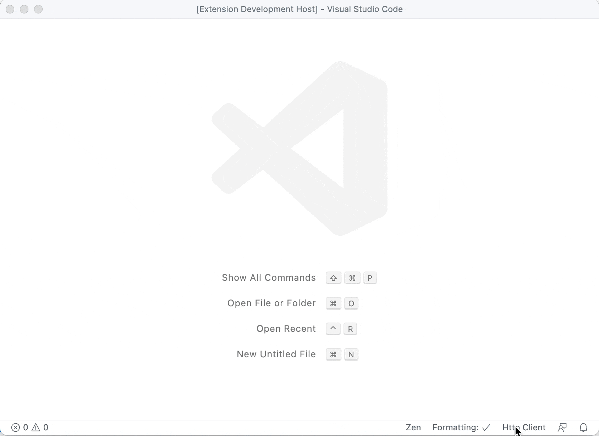
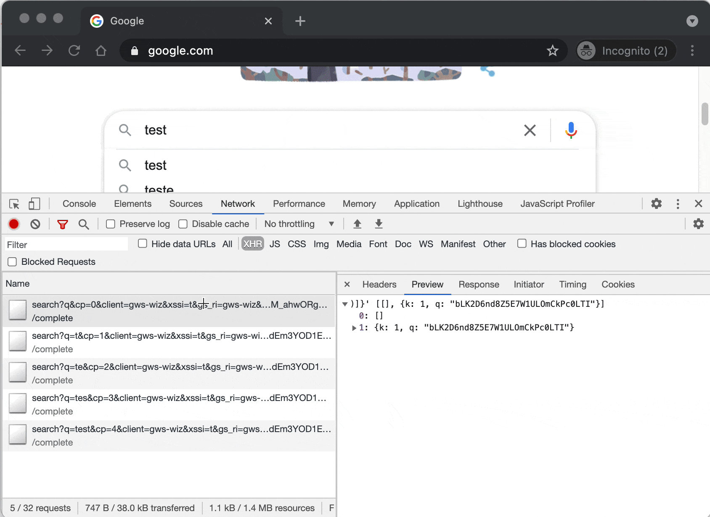

Simple http client, use to send http request, API test. 

Welcome PR, issues, suggestions and stars 🤩 at [github repo](https://github.com/Aaron00101010/vscode-http-client )

# Usage

VSCode Command: Http Client: Open Http Client

## Send Request

Edit it, send it!

## Import By Bash Curl

You can copy curl from network panel in Chrome DevTools 

## License

[MIT](./LICENSE)